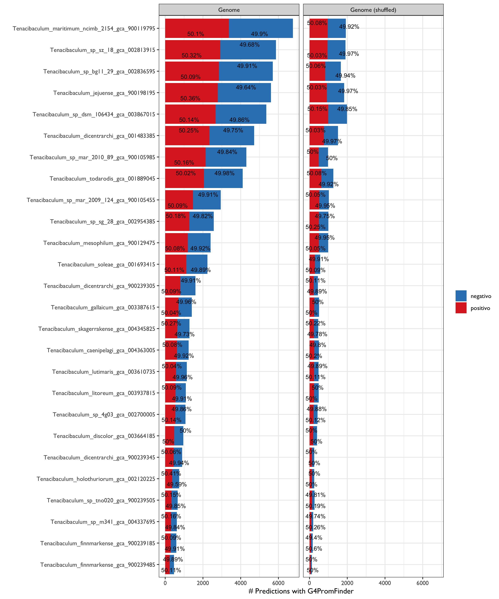

# Studying Non-Canonical G-Quadruplex repertoire in Tenacibaculum: A Case Study

PhD St. Ricardo Gomez-Reyes


Inputs

```bash
srohit@kneipe.lavis.unam.mx/home/srohit/unamworkshop2021/raw_data
```

To do:

1. Randomize (shuffle) Genome Simulations for 26 genomes

2. Test **G4PromFinder** for G4 based promoter prediction

Cite: https://github.com/MarcoDiSalvo90/G4PromFinder

G4PromFinder is an algorithm for the promoter prediction in bacterial genomes. It is recommended for GC rich genomes. G4PromFinder predicts putative promoters based on AT-rich elements and G-quadruplex DNA motifs.

Input: Genome sequences file (Input file must be in fasta format)

Output: a text file containing promoter coordinates and a file containing informations about them.

Let's start

```bash
ssh srohit@kneipe.lavis.unam.mx
# zPjWZBN6aE
```

Modify the G4PromFinder.py in order to make a loop genome-to-genome (script [here](https://github.com/RJEGR/2nd-Workshop-in-Advanced-Bioinformatics/blob/main/G4PromFinder_outputs/HMG4PromFinder.py));

Then:

```bash
for i in $(ls *fa); do  python HMG4PromFinder.py $i; done
#nohup for i in $(ls *fa); do  python HMG4PromFinder.py $i; done &
```

Copy results

```bash
scp -r srohit@kneipe.lavis.unam.mx:/home/srohit/unamworkshop2021/G4PromFinder_outputs .
```

## Test Negative control

**How To Generate Randomized Sequence Based On Sequence Already Known?**

> Example: https://www.biostars.org/p/69756/

```python
import random
dna = list('ATATTCATGAGTACCGTA'); 
print('Original:',''.join(dna))
random.shuffle(dna); 
print('Random:  ',''.join(dna))
```


Instead of python, lets to use the home-made script [here](https://github.com/RJEGR/2nd-Workshop-in-Advanced-Bioinformatics/blob/main/shuffled_genomes.R) (based on https://stat.ethz.ch/pipermail/bioconductor/2013-March/051640.html)

### Data-Viz

Preliminary results




