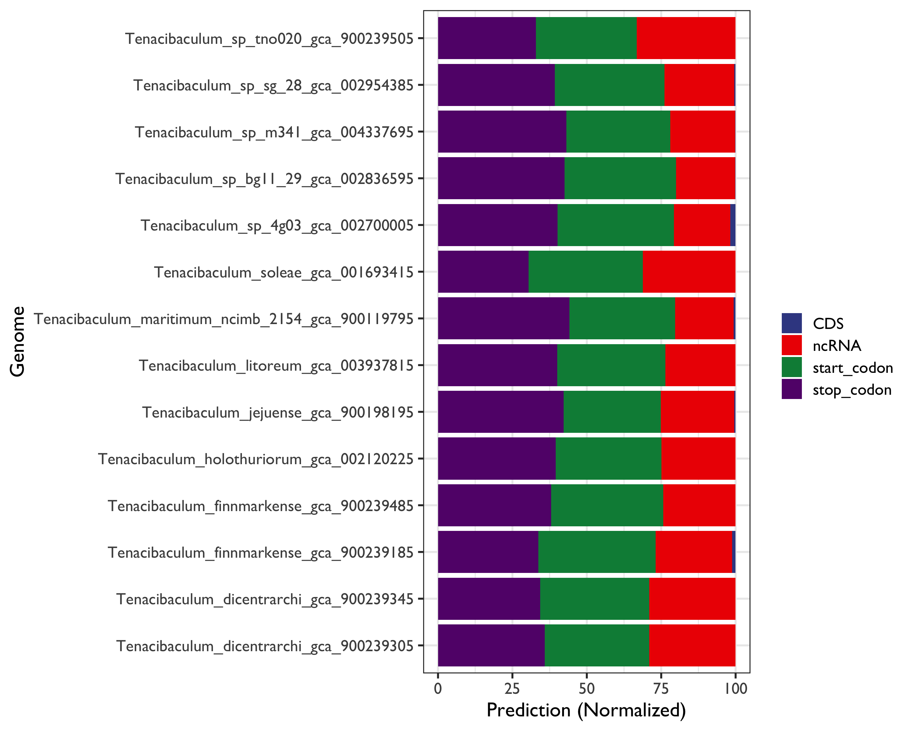
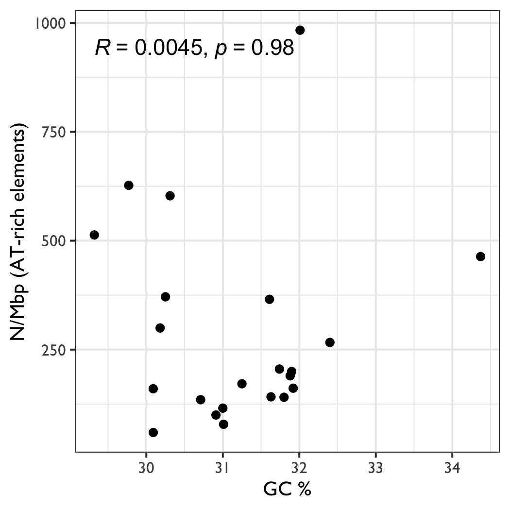

# Studying Non-Canonical G-Quadruplex repertoire in Tenacibaculum: A Case Study

**Teamwork**: Gomez-Reyes Ricardo, Juarez-Figueroa Ulises E., Hurtado Enrique, Ramirez Obed, Satyam Rohit

### Highlights

In addition to G4-Quadruplex predictions, we developed an analysis to decipher the AT-elements than usually found at the 3 primer / 5 primer as a G4-Quadruplex-promoter elements. For this task we use a python software. The results showed than:

- There were from one to three thousand of potential prediction for this propoter elements
- For this genus, there are not relationship in the genome size and Number of promoter (AT-rich regions) prediction, as well as not relatioship between GC content
- Genome wide feature analysis show a positive results at the genome coordiantes regions where  the promoters (AT-rich elements) were predicted.
- Additionally, Our results  highlights a non- canonical elements for the Tenacibaculum genus at the non coding RNA regions. 
- This analysis should be improved 

### Introduction

Nucleic acid sequences rich in guanine are capable of forming four-stranded structures called G-quadruplexes, stabilized by Hoogsteen hydrogen bonding between a tetrad of guanine bases (also called Potential G-quadruplex forming sequences, PQS). At genome level, The PQS (figure 1) has been shown to decrease the activity of the enzyme telomerase, which is responsible for elongating telomeres. Since elevated telomerase activity has been implicated in ∼85% of cancers, this has become a significant strategy for drug development and molecules that bind to and stabilize G-quadruplexes have been identified (Julian L. Huppert et al, 2005). 


Figure 1.

In the genome, there exist many instances in which the PQSs possess more than four G tracks that can result in these sequences adopting dynamic structures equilibrating between multiple folds. Te folding of PQSs to G4s has been implicated in causing strand breaks during replication in the absence of faithful helicases to resolve these roadblocks to polymerase bypass; when located in gene promoters, G4s can regulate transcription of the gene; G4s may be important in telomere biology; and they may function at origins of replication in humans. Experiments have found folded G4s are not limited to the genome as they can fold in the transcriptome (Ding, Y. et al 2018).

Over the last few decades, computational genomics has tremendously contributed to decipher biology from genome sequences and related data. Considerable effort has been devoted to the prediction of transcription promoter and terminator sites that represent the essential "punctuation marks" for DNA transcription 

In all living organisms the flow of genetic information starts with gene transcription, an essential process that is tightly regulated at each step (initiation, elongation, termination). In bacteria and archaea a single RNA polymerase (RNAP), evolutionary conserved features such as similar overall shape in RNAP, highly conserved active centers and similar contact to the nucleic acid chains have been recognized. Recently, G-quadruplex motifs, tertiary structures formed by nucleic acid sequences that are rich in guanine via non-Watson-Crick base pairing, have received a great deal of attention because of their putative role in promoter function.  Interestingly, more than 40% of human gene promoters contain one or more G-quadruplex motifs. In fungi G-quadruplex DNA motifs are significantly associated with promoter regions and to a lesser extent with open reading frames (ORFs), and these DNA motifs are more conserved than expected from a random distribution among related fungi suggesting in vivo functions that are under evolutionary constraint. Conserved G-quadruplex DNA motifs have been also reported in promoters of orthologous gene across phylogenetically distant prokaryotes

G4PromFinder is an algorithm for the promoter prediction in bacterial genomes. It is recommended for GC rich genomes. G4PromFinder predicts putative promoters based on AT-rich elements and G-quadruplex DNA motifs. PromPredict instead identifies promoter regions on the basis of DNA double helix stability, therefore using a different strategy than consensus-based algorithms. In fact, PromPredict algorithm is based on the general observation that promoter regions are less stable than flanking regions [[21](https://bmcbioinformatics.biomedcentral.com/articles/10.1186/s12859-018-2049-x#ref-CR21), [30](https://bmcbioinformatics.biomedcentral.com/articles/10.1186/s12859-018-2049-x#ref-CR30)]. For this reason, PromPredict is a more general tool than consensus-based tools and could be more suitable in GC-rich bacteria featuring diverse σ factors.


Figure 2. A two-step procedure was used to detect putative promoters. The first step consisted in the identification of the putative promoter “AT-rich element”. The second step was the identification of putative G-quadruplex motifs extended up to 50 bp upstream from the 5′-end of the selected AT-rich element. G-quadruplexes could have an influence on gene expression also when localized on the reverse strand relative to transcription direction. For this reason we searched for putative G-quadruplex motifs on either sense or antisense strand (Di Salvo et al 2018). 

There is evidence that G-quadruplex formation in promoter “anchor” (− 35 sequence) elements could impair transcription initiation by RNA polymerase, or if present in the antisense strand of bacterial σ70 promoter between “anchor” and “AT-rich” (− 10 sequence) element could impair the initiation-elongation transition (the so-called promoter clearance). On one hand, recognition of double strand “anchor” sequence in promoters may be strongly influenced by G-quadruplex that could create a physical barrier that hinders RNAP binding or complicates promoter recognition by σ factors. On the other hand, RNAP binding might also facilitate G-quadruplex formation on antisense strand after promoter melting, which ultimately might hamper the initiation-elongation transition. Regulation of G-quadruplex folding and unfolding by G-quadruplex-binding proteins might represent a general mechanism to modulate promoter activity (Di Salvo et al 2018).

#### Discusion


### Started

Inputs

```bash
srohit@kneipe.lavis.unam.mx:/home/srohit/unamworkshop2021/raw_data
```

To do:

1. Randomize Genome Simulations for 26 genomes (2-kmer)
2. Test **G4PromFinder** for both, genome and genome (shuffled)
3. Intersect coordinates with CDS

Cite: https://github.com/MarcoDiSalvo90/G4PromFinder

G4PromFinder is an algorithm for the promoter prediction in bacterial genomes. It is recommended for GC rich genomes. G4PromFinder predicts putative promoters based on AT-rich elements and G-quadruplex DNA motifs.

Input: Genome sequences file (Input file must be in fasta format)

Output: a text file containing promoter coordinates and a file containing informations about them.

Let's start

```bash
ssh srohit@kneipe.lavis.unam.mx
# zPjWZBN6aE	
```


split the fasta

```bash
i=Tenacibaculum_lutimaris_gca_003610735.fa

# sed 's/ /_/g'
# awk '/^>/ {OUT=substr($0,2) ".fa"}; {print >> OUT; close(OUT)}' $i


for i in $(ls *.fa); do  faidx -x $i; done
```


Modify the G4PromFinder.py in order to make a loop genome-to-genome (script [here](https://github.com/RJEGR/2nd-Workshop-in-Advanced-Bioinformatics/blob/main/G4PromFinder_outputs/HMG4PromFinder.py));

Then:

```bash
for i in $(ls *fa); do  python HMG4PromFinder.py $i; done
#nohup for i in $(ls *fa); do  python HMG4PromFinder.py $i; done &


```


Colapse all results in one file

```bash
# 1)  and remove files without results

wc -l *coordinates.txt | grep ' 1 ' | awk '{print $2}'  > delete.txt
while read line; do rm $line; done < delete.txt

# 2) include a basename per sequence and save everything in 
# awk -v var=${i%.fa_coordinates.txt}"\t" 'BEGIN{FS=OFS=var}{print value OFS $0}' $i | tail -n+3 |wc -l

for i in $(ls *fa_coordinates.txt); do awk -v var=${i%.fa_coordinates.txt}"\t" 'BEGIN{FS=OFS=var}{print value OFS $0}' $i | tail -n+3 ;done > coordinates.txt
```

Copy results

```bash
scp -r srohit@kneipe.lavis.unam.mx:/home/srohit/unamworkshop2021/G4PromFinder_outputs .

scp srohit@kneipe.lavis.unam.mx:/home/srohit/unamworkshop2021/raw_data/coordinates.txt .

# zPjWZBN6aE
```

## Test Negative control

**How To Generate Randomized Sequence Based On Sequence Already Known?**

> Example: https://www.biostars.org/p/69756/

```python
import random
dna = list('ATATTCATGAGTACCGTA'); 
print('Original:',''.join(dna))
random.shuffle(dna); 
print('Random:  ',''.join(dna))
```


Instead of python, lets to use the home-made script [here](https://github.com/RJEGR/2nd-Workshop-in-Advanced-Bioinformatics/blob/main/shuffled_genomes.R) (based on https://stat.ethz.ch/pipermail/bioconductor/2013-March/051640.html)

Lets shuffle the genomes based on a sliding window (2-kmer) using `biasaway k -h`  (note: Quadruplexes can be uni-, bi- or tetramolecular (Julian L. Huppert et al, 2005).

```bash
genome=genome.fa

biasaway k --foreground $genome --nfold 1 --kmer 2 --seed 202102 > ${genome%.fa}.random.fn

for genome in $(ls *fa); do biasaway k --foreground $genome --nfold 1 --kmer 2 --seed 20210210 > ${genome%.fa}.random.fn; done
```

Then 

```bash
for i in $(ls kmer_2/*fn); do  python HMG4PromFinder.py $i; done
```

### Intersection 

```bash
# bed convertion for gtf ----

# i=Tenacibaculum_caenipelagi_gca_004363005.gtf
# awk '{ if ($0 ~ "transcript_id") print $0; else print $0" transcript_id \"\";"; }' Tenacibaculum_sp_sg_28_gca_002954385.gtf | gtf2bed - > ${i%.gtf}.bed

for i in $(ls *gtf); do awk '{ if ($0 ~ "transcript_id") print $0; else print $0" transcript_id \"\";"; }' $i | gtf2bed - > ${i%.gtf}.bed;done

# subset genes
# bed=Tenacibaculum_lutimaris_gca_003610735
# cut -f8 $bed | sort | uniq -c
for i in $(ls *gtf); grep '\tgene\t' $i > ${i%.bed}.genes.gtf

cat *genes.gtf > genes.gtf

#or

# awk '{if  ($3 == "mRNA") {print $0}}' file | awk '{print $1,$4,$5} OFS = "\t"


# then intersect
# use -f option
# bedtools intersect will report an overlap between A and B so long as there is at least one base pair is overlapping.50 % minimal overlap fraction

bedtools intersect -wo -f 0.50 -a all.gtf -b coordinates.bed > intersect_bed_f50.txt
cut -f3 intersect_bed_f50.txt| sort | uniq -c

# 

bedtools intersect -wo -f 0.50 -a Tenacibaculum_dicentrarchi_gca_001483385.gtf -b coordinates.bed > Tenacibaculum_dicentrarchi_gca_001483385.intersect_bed_f50.txt

bedtools intersect -wo -f 0.50 -a Tenacibaculum_sp_dsm_106434_gca_003867015.gtf -b coordinates.bed > Tenacibaculum_sp_dsm_106434_gca_003867015.intersect_bed_f50.txt


```

#  Prepare genome - gene table

```bash
grep "^>" *random.fs | awk '{print $1}' | sed 's/:>/\t/g' | sed 's/.random.fs//g' > genome_metadata.txt
```


### Calculate GC content per genome

> https://www.biostars.org/p/300870/#476337

```bash
awk '!/^>/{gc+=gsub(/[gGcC]/,""); at+=gsub(/[aAtT]/,"");} END{ printf "%.2f\n", (gc*100)/(gc+at) }' Tenacibaculum_todarodis_gca_001889045.fa

for i in $(ls *fa); do  echo ${i%.fa};awk '!/^>/{gc+=gsub(/[gGcC]/,""); at+=gsub(/[aAtT]/,"");} END{ printf "%.2f\n", (gc*100)/(gc+at) }' $i; done

# per sequenece
for i in $(ls *fa); do  echo ${i%.fa}; done > id.txt
for i in $(ls *fa); do  awk '!/^>/{gc+=gsub(/[gGcC]/,""); at+=gsub(/[aAtT]/,"");} END{ printf "%.2f\n", gc+at }' $i; done > length.txt
for i in $(ls *fa); do  awk '!/^>/{gc+=gsub(/[gGcC]/,""); at+=gsub(/[aAtT]/,"");} END{ printf "%.2f\n", (gc*100)/(gc+at) }' $i; done > GC.txt

paste -d"\t" id.txt GC.txt length.txt | grep -v 'Chromosome' > GC_content_per_gene.txt

ssh srohit@kneipe.lavis.unam.mx:/home/srohit/unamworkshop2021/raw_data/fasta_splited/GC_content_per_gene.txt .
```

### Calculate genome length

```bash
awk '!/^>/{gc+=gsub(/[gGcC]/,""); at+=gsub(/[aAtT]/,"");} END{ printf "%.2f\n", gc+at }' Tenacibaculum_todarodis_gca_001889045.fa

# for i in $(ls *fa); do  awk '!/^>/{gc+=gsub(/[gGcC]/,""); at+=gsub(/[aAtT]/,"");} END{ printf "%.2f\n", gc+at }' $i; done
```

| Index                                            | GC    |  Size   |
| ------------------------------------------------ | ----- | :-----: |
| Tenacibaculum_caenipelagi_gca_004363005          | 31.88 | 3266097 |
| Tenacibaculum_dicentrarchi_gca_001483385         | 31.48 | 2918253 |
| Tenacibaculum_dicentrarchi_gca_900239305         | 30.18 | 2663544 |
| Tenacibaculum_dicentrarchi_gca_900239345         | 30.09 | 2804033 |
| Tenacibaculum_discolor_gca_003664185             | 31.63 | 3376020 |
| Tenacibaculum_finnmarkense_gca_900239185         | 30.91 | 2923232 |
| Tenacibaculum_finnmarkense_gca_900239485         | 31.01 | 2955007 |
| Tenacibaculum_gallaicum_gca_003387615            | 31.74 | 3422893 |
| Tenacibaculum_holothuriorum_gca_002120225        | 31    | 3147654 |
| Tenacibaculum_jejuense_gca_900198195             | 30.31 | 4614879 |
| Tenacibaculum_litoreum_gca_003937815             | 31.92 | 3376591 |
| Tenacibaculum_lutimaris_gca_003610735            | 31.9  | 2868850 |
| Tenacibaculum_maritimum_ncimb_2154_gca_900119795 | 32.01 | 3435971 |
| Tenacibaculum_mesophilum_gca_900129475           | 31.61 | 3286619 |
| Tenacibaculum_skagerrakense_gca_004345825        | 31.25 | 3712612 |
| Tenacibaculum_soleae_gca_001693415               | 30.25 | 3006944 |
| Tenacibaculum_sp_4g03_gca_002700005              | 31.8  | 3812359 |
| Tenacibaculum_sp_bg11_29_gca_002836595           | 29.77 | 4537492 |
| Tenacibaculum_sp_dsm_106434_gca_003867015        | 32.01 | 3511704 |
| Tenacibaculum_sp_m341_gca_004337695              | 30.09 | 5123891 |
| Tenacibaculum_sp_mar_2009_124_gca_900105455      | 32.4  | 5524492 |
| Tenacibaculum_sp_mar_2010_89_gca_900105985       | 29.32 | 4172912 |
| Tenacibaculum_sp_sg_28_gca_002954385             | 34.37 | 2761692 |
| Tenacibaculum_sp_sz_18_gca_002813915             | 31.14 | 4019179 |
| Tenacibaculum_sp_tno020_gca_900239505            | 30.71 | 2452834 |
| Tenacibaculum_todarodis_gca_001889045            | 30.73 | 3019213 |

### Data-Viz

Preliminary results







### Highlights


In addition to G4-Quadruplex predictions, we developed an analysis to decipher the AT-elements than usually found at the 3 primer / 5 primer as a G4-Quadruplex-promoter elements. For this task we use a python software. The results showed than:

- There were from one to three thousand of potential prediction for this propoter elements
- For this genus, there are not relationship in the genome size and Number of promoter (AT-rich regions) prediction, as well as not relatioship between GC content
- Genome wide feature analysis show a positive results at the genome coordiantes regions where  the promoters (AT-rich elements) were predicted.
- Additionally, Our results  highlights a non- canonical elements for the Tenacibaculum genus at the non coding RNA regions. 
- This analysis should be improved 

## Cites

Aziz Khan, Rafael Riudavets Puig, Paul Boddie, Anthony Mathelier, BiasAway: command-line and web server to generate nucleotide composition-matched DNA background sequences, *Bioinformatics*, 2020;, btaa928, https://doi.org/10.1093/bioinformatics/btaa928

Ding, Y., Fleming, A. M., & Burrows, C. J. (2018). Case studies on potential G-quadruplex-forming sequences from the bacterial orders Deinococcales and Thermales derived from a survey of published genomes. *Scientific reports*, *8*(1), 1-11. DOI:10.1038/s41598-018-33944-4

Di Salvo, M., Pinatel, E., Talà, A., Fondi, M., Peano, C., & Alifano, P. (2018). G4PromFinder: an algorithm for predicting transcription promoters in GC-rich bacterial genomes based on AT-rich elements and G-quadruplex motifs. *BMC bioinformatics*, *19*(1), 1-11. https://doi.org/10.1186/s12859-018-2049-x

Julian L. Huppert, Shankar Balasubramanian, Prevalence of quadruplexes in the human genome, *Nucleic Acids Research*, Volume 33, Issue 9, 1 May 2005, Pages 2908–2916, https://doi.org/10.1093/nar/gki609

