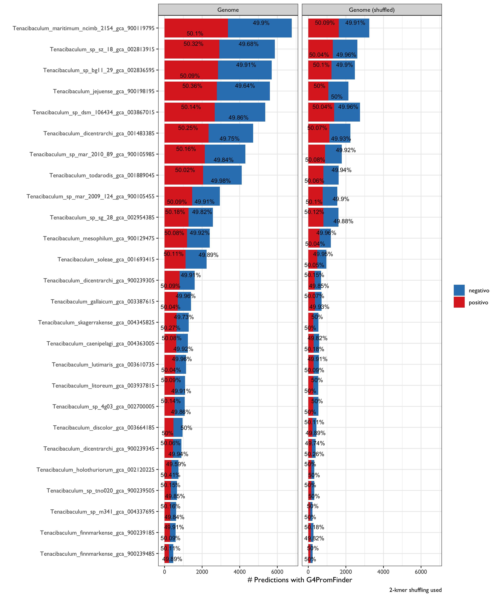

# Studying Non-Canonical G-Quadruplex repertoire in Tenacibaculum: A Case Study

PhD St. Ricardo Gomez-Reyes

### Introduction

Nucleic acid sequences rich in guanine are capable of forming four-stranded structures called G-quadruplexes, stabilized by Hoogsteen hydrogen bonding between a tetrad of guanine bases. The formation of these telomeric quadruplexes has been shown to decrease the activity of the enzyme telomerase ( [8](javascript:;) ), which is responsible for elongating telomeres. Since elevated telomerase activity has been implicated in ∼85% of cancers ( [9](javascript:;) ), this has become a significant strategy for drug development ( [10](javascript:;) ) and molecules that bind to and stabilize G-quadruplexes have been identified. Recently, there has been growing interest in quadruplex-forming sequences elsewhere in the genome (Julian L. Huppert et al, 2005)


### Started

Inputs

```bash
srohit@kneipe.lavis.unam.mx/home/srohit/unamworkshop2021/raw_data
```

To do:

1. Randomize Genome Simulations for 26 genomes (2-kmer)

2. Test **G4PromFinder** for both, s

Cite: https://github.com/MarcoDiSalvo90/G4PromFinder

G4PromFinder is an algorithm for the promoter prediction in bacterial genomes. It is recommended for GC rich genomes. G4PromFinder predicts putative promoters based on AT-rich elements and G-quadruplex DNA motifs.

Input: Genome sequences file (Input file must be in fasta format)

Output: a text file containing promoter coordinates and a file containing informations about them.

Let's start

```bash
ssh srohit@kneipe.lavis.unam.mx
# zPjWZBN6aE
```

Modify the G4PromFinder.py in order to make a loop genome-to-genome (script [here](https://github.com/RJEGR/2nd-Workshop-in-Advanced-Bioinformatics/blob/main/G4PromFinder_outputs/HMG4PromFinder.py));

Then:

```bash
for i in $(ls *fa); do  python HMG4PromFinder.py $i; done
#nohup for i in $(ls *fa); do  python HMG4PromFinder.py $i; done &
```

Copy results

```bash
scp -r srohit@kneipe.lavis.unam.mx:/home/srohit/unamworkshop2021/G4PromFinder_outputs .
```

## Test Negative control

**How To Generate Randomized Sequence Based On Sequence Already Known?**

> Example: https://www.biostars.org/p/69756/

```python
import random
dna = list('ATATTCATGAGTACCGTA'); 
print('Original:',''.join(dna))
random.shuffle(dna); 
print('Random:  ',''.join(dna))
```


Instead of python, lets to use the home-made script [here](https://github.com/RJEGR/2nd-Workshop-in-Advanced-Bioinformatics/blob/main/shuffled_genomes.R) (based on https://stat.ethz.ch/pipermail/bioconductor/2013-March/051640.html)


Based on literature (), lets shuffle the genomes based on a sliding window (2-kmer) using `biasaway k -h`  (note: Quadruplexes can be uni-, bi- or tetramolecular (Julian L. Huppert et al, 2005).

```bash
genome=genome.fa

biasaway k --foreground $genome --nfold 1 --kmer 2 --seed 202102 > ${genome%.fa}.random.fn

for genome in $(ls *fa); do biasaway k --foreground $genome --nfold 1 --kmer 2 --seed 20210210 > ${genome%.fa}.random.fn; done
```

Then 

```bash
for i in $(ls kmer_2/*fn); do  python HMG4PromFinder.py $i; done
```


### Data-Viz

Preliminary results




## Cites

Aziz Khan, Rafael Riudavets Puig, Paul Boddie, Anthony Mathelier, BiasAway: command-line and web server to generate nucleotide composition-matched DNA background sequences, *Bioinformatics*, 2020;, btaa928, https://doi.org/10.1093/bioinformatics/btaa928

Julian L. Huppert, Shankar Balasubramanian, Prevalence of quadruplexes in the human genome, *Nucleic Acids Research*, Volume 33, Issue 9, 1 May 2005, Pages 2908–2916, https://doi.org/10.1093/nar/gki609

